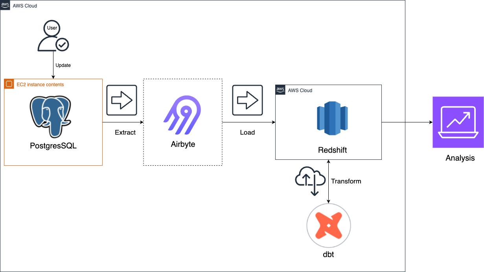
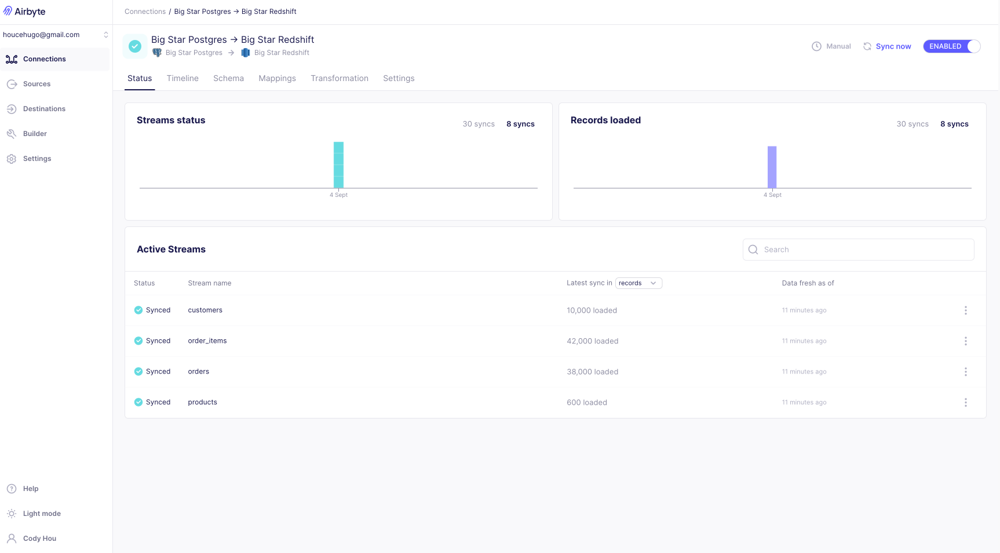
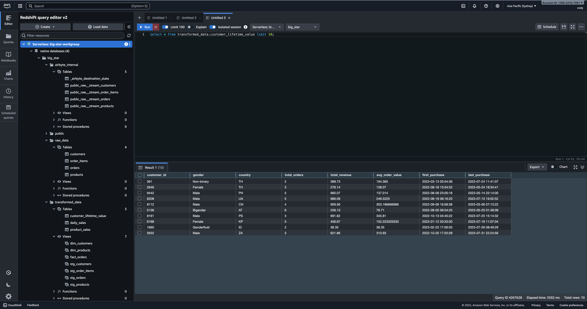
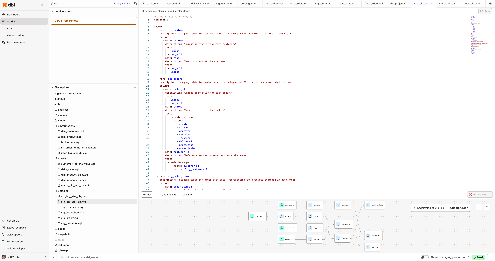
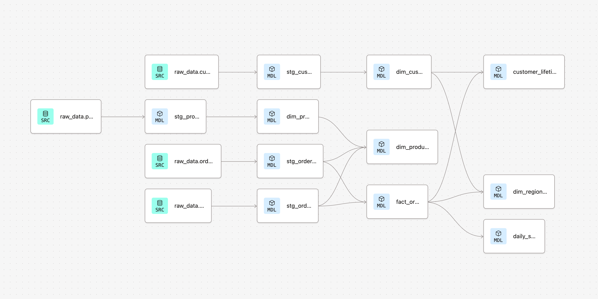

# 📊 End-to-End Data Engineering Pipeline for Big Star

> 💡 **Automated ELT pipeline** for ingesting data with **Airbyte**, transforming it with **dbt**, and orchestrating analytics on **AWS Redshift**, powered by **Postgres** and containerized with **Docker**.

This project builds a modern ELT pipeline to process raw e-commerce data into analytics-ready tables in Amazon Redshift. The pipeline powers dashboards for marketing, sales, and operations, enabling real-time decision-making.

## 🚀Project Overview
> 🚗 **Use case:** Help marketing & operations teams explore product sales, customer behaviors, and inventory trends through automated analytics.

[Big Star Collectibles](https://bigstarcollectibles.com/) is an e-commerce platform specializing in unique merchandise such as stickers, stationery, apparel, and collectibles.  
This project demonstrates the design and implementation of an **end-to-end ELT data pipeline** to support data-driven decision-making for Big Star’s operations.  

### Key Objectives

- **Automated Data Extraction**: Use **Airbyte** to extract raw tables (orders, customers, products, order_items) from a PostgreSQL database.  
- **Centralized Data Loading**: Load extracted data into **AWS Redshift** as the single source of truth for analytics.  
- **Robust Data Modeling**: Build layered models with **dbt** (staging → intermediate → marts), including:
  - **fact_orders** (fact table for transactions)  
  - **dim_customers**, **dim_products** (dimension tables)  
  - Enriched intermediate models for order items and order totals  
- **Data Quality Assurance**: Apply schema descriptions and dbt tests (`not_null`, `unique`, `accepted_values`, `relationships`) to ensure reliable and trusted data.  
- **Containerized Deployment**: Use **Docker** to package dbt and Airbyte for scalable deployment with CI/CD integration.  
- **Business Value**: Deliver curated data marts that power BI dashboards, Customer Lifetime Value (CLV) analysis, and sales performance tracking.  

This project showcases modern data engineering best practices by combining **SQL, AWS, Airbyte, dbt, Redshift, and Postgres** into a production-ready ELT workflow.

## 🏗️ Architecture

This project implements a modern **ELT pipeline** for Big Star Collectibles. The pipeline follows the Medallion Architecture pattern (Staging → Intermediate → Marts) to ensure modularity and scalability. The architecture is designed to be **scalable, modular, and production-ready**, leveraging cloud infrastructure and orchestration tools.

### Architecture Diagram

### Data Flow

1. **Data Sources**  
   - PostgreSQL transactional database for orders, customers, products, and order_items.  
   - Optional external CSV/JSON sources for enrichment.

2. **Ingestion Layer**  
   - **Airbyte** is used to extract raw data from PostgreSQL and other sources.  
   - Supports incremental and full-load extraction.  

3. **Data Warehouse / Storage**  
   - **AWS Redshift** serves as the centralized data warehouse.  
   - Raw data is loaded into **staging tables** for processing.

4. **Transformation Layer**  
   - **dbt** is used to build modular, layered models:  
     - **Staging Models**: Clean and normalize raw data.  
     - **Intermediate Models**: Enrich data, calculate order totals, item counts, etc.  
     - **Marts / Fact & Dimension Tables**: Ready for analytics and BI dashboards (e.g., `fact_orders`, `dim_customers`, `dim_products`).

5. **Data Quality & Testing**  
   - dbt tests (`not_null`, `unique`, `accepted_values`, `relationships`) ensure data integrity across all layers.  
   - Schema documentation provides observability and governance.

6. **Orchestration & Deployment**  
   - **Docker** containerizes dbt and Airbyte jobs.  
   - **CI/CD** pipelines automate testing, builds, and deployments for consistent data workflows.

7. **Analytics & Business Insights**  
   - Final data marts support:  
     - **Customer Lifetime Value (CLV)** calculations  
     - **Sales trend analysis**  
     - **Dashboard visualizations** with BI tools  

## Prerequisites
Ensure you have Python 3 installed. If not, you can download and install it from Python's official website.

## Installing
1. Fork the Repository:
    - Click the "Fork" button on the top right corner of this repository.
2. Clone the repository:
    - `git clone https://github.com/YOUR_USERNAME/end-to-end-data-engineering-project-4413618.git`
    - Note: Replace YOUR_USERNAME with your GitHub username
3. Navigate to the directory:
    - `cd end-to-end-data-engineering-project-4413618`
4. Set Up a Virtual Environment:
    - For Mac:
        - `python3 -m venv venv` 
        - `source venv/bin/activate`
    - For Windows:
        - `python -m venv venv`
        - `.\venv\Scripts\activate`
5. Install Dependencies:
    - `pip install -e ".[dev]"`

## ⚙️ Tech Stack

This project leverages a modern **Data Engineering toolkit** to ensure scalability, modularity, and maintainability.

- **Languages**
  - Python 🐍 – scripting, orchestration, and automation
  - SQL – transformations, modeling, and analytics

- **Data Ingestion**
  - Airbyte –  Open-source and extensible, ideal for ELT ingestion. ELT pipeline for extracting and loading data from PostgreSQL and external sources

- **Data Warehouse**
  - Amazon Redshift – Cloud-native data warehouse optimized for analytics at scale.

- **Transformation & Modeling**
  - dbt (Data Build Tool) – Industry-standard for SQL-based transformations and testing. Modular transformations, testing, documentation, and lineage tracking

- **Containerization & Orchestration**
  - Docker – containerized environments for reproducibility
  - (Optional) Airflow – workflow orchestration and scheduling

- **Version Control & CI/CD**
  - Git + GitHub – collaborative development and version control
  - GitHub Actions – automated testing, builds, and deployments

- **Data Visualization**
  - Power BI / Tableau – dashboards and business intelligence reporting

- **Monitoring & Data Quality**
  - dbt tests – built-in validation (`unique`, `not_null`, `relationships`, `accepted_values`)
  - Documentation & lineage – automatic docs generated in dbt
## 📊 Example Output

This project delivers a fully functional **end-to-end data pipeline** that ingests, transforms, and models e-commerce data for analytics and decision-making.  
Below are some example outputs from the system:

### 1. Data Ingestion with Airbyte
- Automated extraction from **PostgreSQL** source
- Incremental sync into **Amazon Redshift**
- Configurable pipelines for scalability  

---

### 2. Data Warehouse – Amazon Redshift
- Raw and transformed tables available in a scalable, columnar warehouse  
- Schema structured into **`staging` → `intermediate` → `mart`** layers  

---

### 3. Data Transformation with dbt
- Modular SQL models for transformations
- Automated **tests** (`unique`, `not_null`, `relationships`, `accepted_values`)
- Full documentation generated  

---

### 4. Data Lineage & Governance
- Clear lineage across **sources → staging → marts**
- Provides full transparency and trust in the data pipeline  

---

### ✅ Final Outcome
- Reliable **single source of truth** for analytics  
- Scalable ELT architecture with **Postgres + Airbyte + Redshift + dbt**  
- Ready for BI dashboards (Power BI / Tableau) for actionable insights
- These curated data marts enabled customer churn analysis, CLV segmentation, and product-level profitability tracking.

